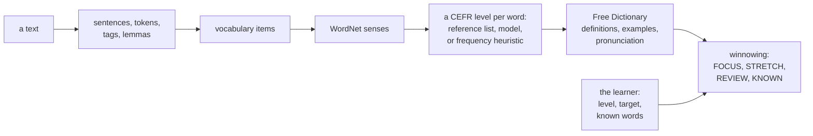
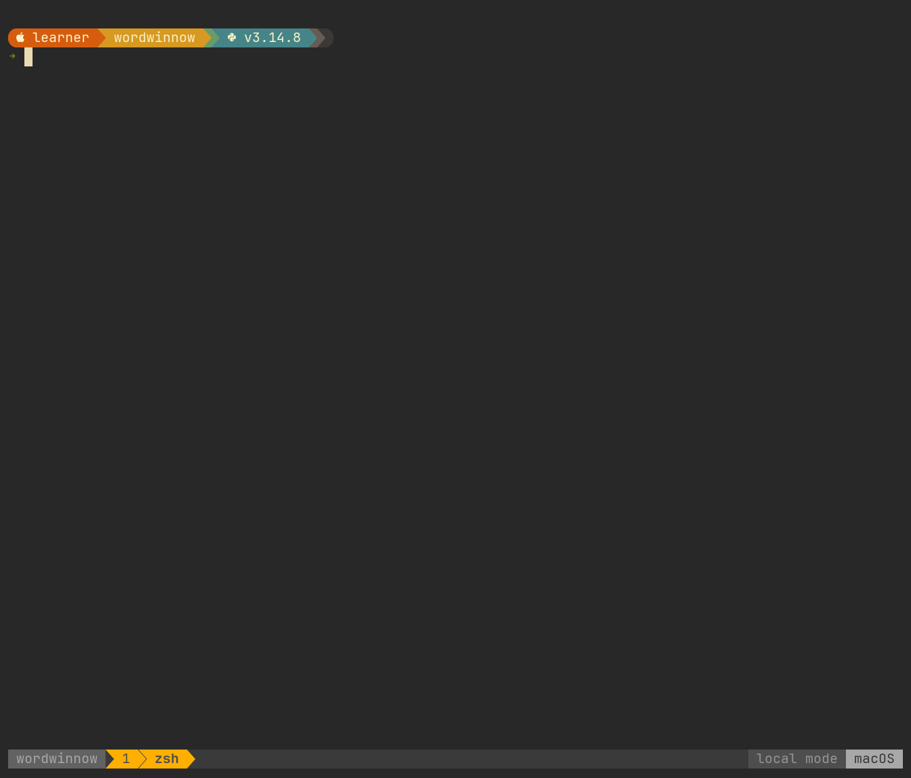
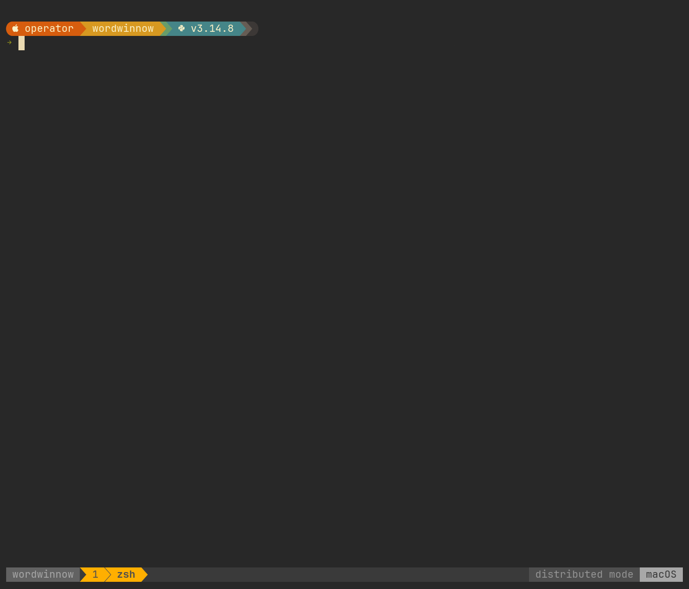

# Wordwinnow

Winnow a text into the vocabulary worth a learner's attention.

[](https://github.com/wordbench/wordwinnow/actions/workflows/ci.yml)
[](LICENSE)
[](https://github.com/olegturzhanskii/engineering-conventions/blob/v1.1.0/STANDARD.md)

You have a text you want to read in English: an article, a chapter, the
subtitles of an episode.

Some of its words are already yours, some are within reach, and some are
beyond you for now.

Wordwinnow reads the text, gives every word a [CEFR](https://www.coe.int/en/web/common-european-framework-reference-languages) level, and places each
word against the level you have and the level you are working toward.

> **The word has a level.**
>
> **The learner has a goal.**
>
> **The tier is where they meet.**

To winnow is to separate grain from chaff by letting the wind carry off what
is light; Wordwinnow does that to a text, with what you tell it about yourself
as the wind, and separates the words that deserve your attention now from the
ones to keep for later and the ones you likely know already.

The name is *word* and *winnow*.

Split another way, it also spells *word, win, now*, a second reading that is
there on purpose: the words you can win from a text you want to read, while
you read it.

It points; you decide which words to learn, and the learning stays yours.

It reads a text one word at a time, gives each word one level for each part of
speech it takes, and knows you by three facts: your level, the level you are
working toward, and the words you already know; [`docs/product.md`](docs/product.md) says who
that serves, what it costs, and how it relates to Wordbench, and
[`data/corpus/README.md`](data/corpus/README.md) tells where the idea came from.

## What it does

Give it a text and three facts about yourself: your level, your target level,
and the words you already know.

It answers with the vocabulary of the text in study order, each word with its
level and its meaning, and, on its card, the sentence it appeared in.



The text can be a file of your own, in plain text, Markdown, SRT, or WebVTT,
or one of the New York Times sources the tool fetches for you.

The report is a table, one card per word, JSON for another program, or CSV for
a flashcard tool.

## Running it

```sh
make setup
```

```sh
make nltk-data
```

```sh
make model
```

```sh
uv run wordwinnow analyze data/corpus/a-scandal-in-bohemia.txt --local --level A2 --target B1 --no-dictionary
```

That analyzes "A Scandal in Bohemia," the first Sherlock Holmes short story,
in one process against a SQLite file, for a learner at A2 working toward B1,
with the level model `make model` trains for the words the reference lists do
not cover; [`data/corpus/README.md`](data/corpus/README.md) says why it is this story.



`make up-full` starts the distributed mode, where the same pipeline runs as
services over PostgreSQL, Kafka, Redis, and ClickHouse, and the same command
without `--local` sends the text there.

While it works, `analyze` says on standard error what it is doing, and
`--view operator` adds under that line what the dictionary is doing: the lookups
in flight and what each waits for, the request budget, the answers that came
from the cache, the retries, and the circuit.



The recording asks a stand-in for the dictionary provider, which stops and
starts answering when it is told to, so that the outage and the recovery come
on cue.

[`docs/getting-started.md`](docs/getting-started.md) takes it from here.

## How the code is organized

The code keeps the rules about words and learners apart from the technologies
that run them, in one package of four layers: the domain, the use cases and
their ports, the adapters, and the deployable services.

The domain imports nothing but the standard library, and a test proves it.

Everything outside the text is an adapter: a document source, the dictionary,
the lexical network, the stores, the message bus.

The analysis itself only ever sees the text, so another endpoint of The New
York Times is one adapter and its two entries in the composition root;
[`docs/architecture.md`](docs/architecture.md) says what another provider takes.

## Documentation

Start at [`docs/README.md`](docs/README.md), which says which document owns which question.

| | |
| --- | --- |
| [`docs/product.md`](docs/product.md) | What it is for, what it knows about the learner, and what it will not do |
| [`docs/getting-started.md`](docs/getting-started.md) | Getting it running, in both modes |
| [`docs/domain.md`](docs/domain.md) | The vocabulary, the invariants, and how a word gets its level |
| [`docs/architecture.md`](docs/architecture.md) | Layers, ports, adapters, events, and one analysis end to end |
| [`docs/operating.md`](docs/operating.md) | The commands, the configuration, watching it, recovering it |
| [`docs/performance.md`](docs/performance.md) | What was measured, and what to run for it |

## Status

Wordwinnow is feature-complete at v1.0.0, and an error found in it may still
be corrected; my later work on the same problem is Wordbench, a separate
project, as [`docs/product.md`](docs/product.md) explains.

Its license does not permit changing the code, so it takes no pull requests;
an issue is the way to report an error.

## Who made it, and how

Generative AI did a substantial part of the engineering work on Wordwinnow,
through models of two families: Claude, by [Anthropic](https://www.anthropic.com), and GPT, by [OpenAI](https://openai.com).

Claude models worked in the codebase: they investigated open questions,
proposed and weighed alternatives, wrote much of the code, tests, and
documentation, traced defects, took measurements, and reviewed and refined the
work.

GPT models worked with me at the level of the whole project: they helped me
assess its state, formulate and organize requirements and reasoning, keep that
reasoning continuous from one stage of the work to the next, find omissions
and inconsistencies, question assumptions and formulations, and review the
engineering method and the documentation.

I decided what Wordwinnow is for and what it leaves to the learner, set its
requirements and constraints, chose the technologies and tools it is built
with, made its architectural and technical decisions, judged the results, and
settled which proposals and implementations went in, which were revised, and
which were dropped.

The roles did not divide into "the AI writes, I approve": problems were
reasoned through together, and proposals and objections came from both sides.

Every change, whoever drafted it, answers to the same tests and the same
coding standard, and nothing went in because the AI reported that it worked.

Who drafted a function or a paragraph is a different question from whose
decisions it embodies: the decisions in Wordwinnow are mine, and so are the
result and the responsibility for it.

## License

Wordwinnow is source-available, not open source.

Its own code, tests, and documentation are licensed under the PolyForm Strict
License 1.0.0, in [`LICENSE`](LICENSE): you may use them for any noncommercial purpose,
including personal study and research, and so may noncommercial organizations
such as educational institutions; the license does not permit distributing
them, changing them or building new works on them, even privately, or using
them commercially.

Its copyright license reaches the code and the text, not the ideas, methods,
or functionality they express; it does not limit fair use where the law
provides it, and anything it does not permit needs the copyright holder's
separate permission.

The files that enforce the project's coding standard are a separate case:
`tools/check_conventions.py`, `tools/check_commit_message.py`, `.taplo.toml`, and
the Ruff tables `pyproject.toml` marks as copied are unchanged copies from the
[engineering conventions standard](https://github.com/olegturzhanskii/engineering-conventions/blob/v1.1.0/STANDARD.md), a separate project whose rules Wordwinnow
follows rather than a dependency, and they keep that project's
[Apache License 2.0](https://github.com/olegturzhanskii/engineering-conventions/blob/v1.1.0/LICENSE), which does not extend to anything else here.

The reference word lists, the sample story, the dictionary's definitions, the
services Wordwinnow calls, and anything fetched from The New York Times keep
their own terms; [`NOTICE`](NOTICE) says which, and what GitHub's own terms allow on a
public repository, and [`data/reference/ATTRIBUTION.md`](data/reference/ATTRIBUTION.md) and
[`data/corpus/README.md`](data/corpus/README.md) hold the details.

## Toolchain

Python 3.14, `uv`, `ruff`, `ty`, `pytest`, and `gitleaks`.

NLTK with WordNet 3.0, wordfreq, and scikit-learn for the analysis; SQLite for
the local mode; PostgreSQL, Kafka, Redis, and ClickHouse for the distributed
mode, with Prometheus, Tempo, and Grafana beside it.

`make help` lists the checks, and `make verify` is the one gate.
