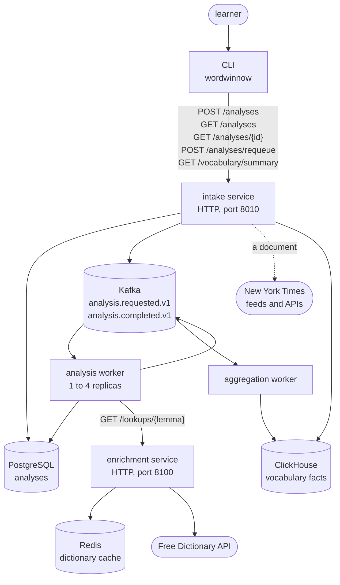
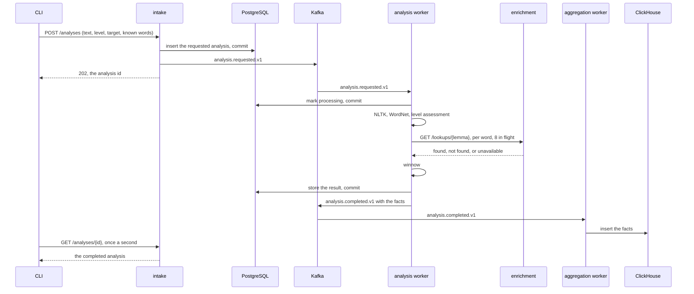

# Architecture

Wordwinnow takes a text and a learner and returns a study report; this page
shows how the code is arranged to do that, and why each part is there.

It runs in two modes that share every rule.

The **local mode** does the whole analysis inside one command, against a SQLite
file, and it is all one learner needs.

The **distributed mode** runs the same use cases as five processes over
PostgreSQL, Kafka, Redis, and ClickHouse, to show how the same product is
built as a system of services and kept correct when parts of it fail; the last
section names the problem each of those technologies answers.

## Layers

```text
wordwinnow/
├── domain/          the model and its rules; standard library only
├── application/     use cases as functions, and the ports they need
├── infrastructure/  adapters, one package per concern, and the composition root
└── services/        deployable processes and the experiments
```

The domain holds the rules, the application holds the use cases and declares
what they need from outside, the infrastructure supplies it, and the services
are the processes that run it all.

Dependencies point inward: `domain` imports only the standard library,
`application` imports `domain`, `infrastructure` imports both, and `services` imports
everything.

A fitness test scans every import and proves the rule, with a synthetic
violation it is shown to catch.

The composition root, `infrastructure/composition.py`, is where settings become
adapters for every process, so replacing a technology never touches a use
case; the few commands that need only one or two adapters, such as `doctor` and
the benchmarks, build them directly.

## Three ideas, and what each buys

The structure applies three established ideas, each with its own literature
and vocabulary: Domain-Driven Design, Hexagonal Architecture, and Event-Driven
Architecture.

Naming them lets a reader who knows one recognize it here, and lets a reader
who does not look it up; each keeps the code that states the learner's problem
independent of the technologies that serve it, although, as [the last section](#why-each-technology-is-here)
says, those technologies shaped what the problem became.

**Domain-Driven Design: the problem's own words, in code that depends on
nothing.**

[Domain-Driven Design](https://www.domainlanguage.com/ddd/), often shortened to DDD, is the approach Eric Evans set
out in his book of that name: model the problem in its own vocabulary, and
keep that model at the center of the code.

Its first tool is a *ubiquitous language*, the words that people who know the
problem and the code itself both use, each with one meaning: here a document,
a vocabulary item, a level and where it came from, a learner profile, and a
study tier; [`domain.md`](domain.md) is that vocabulary.

Because the domain imports only the standard library, the rules that decide a
report, the tiers, the order in which a level's sources answer, the three
outcomes of a lookup, and how long someone else's text may be kept, are tested
without a database, a broker, or a network.

Three more of its terms describe the domain's shape.

A *bounded context* is the region in which the ubiquitous language holds, every
term keeping one meaning; Wordwinnow needs only one, because no word here
means different things in different parts of the system.

An *aggregate* is the object that guards state that changes and decides how it
may change, so that its rules, its invariants, always hold; here it is the
analysis, whose lifecycle, from requested to completed or failed, is the only
thing that changes, and [`domain.md`](domain.md#the-invariants) states which changes it allows, along with
the domain's other invariants.

A *domain event* is a fact the model records when something that matters has
happened; the analysis records two, *requested* and *completed*, because other
parts of the system react to exactly those two, and they are what the third
idea below carries between processes.

**Hexagonal Architecture: everything outside the rules can be replaced.**

Alistair Cockburn named this pattern [Hexagonal Architecture](https://alistair.cockburn.us/hexagonal-architecture/), and its other
name, *ports and adapters*, says how it works: the application sits at the
center, every outside thing, a user, a database, a provider, sits at its edge,
and the application reaches each one only through an interface it declares
itself; the hexagon is only a way of drawing many sides, not a rule about six.

A *port* is such an interface, for something the application needs from outside,
such as a text's sentences, a word's frequency, a dictionary, or a store, and
an *adapter* is one technology's implementation of it.

The pattern distinguishes the side that drives the application, here the
command line and the services, from the side the application drives, the
dictionaries, the sources, the stores, and the broker; on the driving side the
use cases themselves are the port, called directly, so every interface
Wordwinnow declares is on the driven side.

Here each port is a `Protocol` in a module named after it, a use case is a
function that takes ports as arguments, and the composition root decides which
adapters to pass.

So the same use cases run in one process against SQLite, an in-memory cache,
and no broker, and as services against PostgreSQL, Redis, and Kafka, and every
test of a use case passes fakes instead.

Two dictionaries, the Free Dictionary API and WordNet, answer one port, and
five New York Times sources answer another, and nothing in the use cases tells
them apart.

The inward dependencies of the layers above are what make this possible: an
adapter imports the application to implement its port, and never the other way
around.

**Event-Driven Architecture: the slow part happens elsewhere, at its own pace.**

In an [event-driven architecture](https://martinfowler.com/articles/201701-event-driven.html), processes do not call one another to get
work done; one publishes an *event*, a record that something happened, and
whoever needs to react subscribes, so the publisher need not know who reads
it.

The distributed mode is event-driven at exactly one seam: the two domain
events cross process boundaries as two Kafka topics,
`wordwinnow.analysis.requested.v1` and `wordwinnow.analysis.completed.v1`, while
everywhere else processes call each other directly over HTTP, the command line
calling intake and a worker calling the enrichment service.

In the local mode the same events are recorded and handed to a publisher that
sends them nowhere, because one process does all the work.

So intake answers at once while a worker does the slow part asynchronously,
more workers are added by joining a consumer group, and the aggregation worker
learns about finished analyses without the analysis worker knowing that
ClickHouse exists.

The price is the usual one for event-driven processing: a message may be
handled more than once, so every effect must be harmless when repeated, and
the system is only *eventually consistent*, a result arriving after the request
that asked for it and the statistics after the result; [delivery](#delivery-is-at-least-once) says how
both are met.

## Where texts come from

The analysis itself takes text and nothing else: the pipeline never sees a
document's title, its origin, or its terms.

A text enters by one of two routes.

**Your own text**, a file or standard input in plain text, Markdown, SRT, or
WebVTT, is read by the command line and turned into a document by one function
at the edge, `document_from_text`, which recognizes subtitles by their cue lines
and keeps only what is spoken.

Those formats are not sources, and another format means changing that function
rather than adding an adapter.

**A named source** is an adapter behind the `DocumentSource` port, which acquires
one document about a topic; the five New York Times sources are five such
adapters, four of them behind one credentialed client, each registered by name
in the composition root and chosen by name in a request.

A document that belongs to someone else carries its terms into the domain as
facts about the text, not about its provider: an attribution to show,
references to read it in full, and a retention after which the analysis is
deleted; the report renders the first two, the purge enforces the third, and
no adapter is consulted again.

A document also carries a label, `DocumentOrigin`, for the kind of source it
came from, your own text or The New York Times, which the report prints and
the statistics count, and no rule in the domain depends on it.

## Extending it

The tool reaches outside itself in two ways, a dictionary for meanings and a
source for texts, and both are extended the way Hexagonal Architecture
intends: an adapter on the driven side that translates a provider's answers
and terms into the domain's own values, and one place in the composition root
that chooses it.

The symmetry holds exactly as far as the domain stays silent about providers,
and each section below says where it stops.

### Another dictionary

The `Dictionary` port is one method, `look_up`, which takes a lemma and returns a
`DictionaryLookup`: found with its entries, not found, or unavailable with a
reason.

An entry is a headword, a pronunciation or none, meanings by part of speech,
and a `Provenance`: the license its definitions are shown under, the pages they
came from, or both.

Two adapters satisfy the port:

- `FreeDictionaryClient` asks the Free Dictionary API, which returns
  Wiktionary's license and a page per word, and the composition root puts it
  behind a cache and a request budget.
- `WordNetDictionary` answers from the local WordNet corpus with the WordNet
  license and no page, because WordNet has none to link to, and needs neither
  the cache nor the budget.

A third dictionary is the same work:

1. A class in `infrastructure/dictionary/` with
   `async def look_up(self, *, lemma: str) -> DictionaryLookup`, which
   translates the provider's answer into the domain's entries and its terms
   into a `Provenance`, and a test beside `test_wordnet_dictionary.py`.
2. A name for it in `DictionaryName`, in `infrastructure/settings.py`.
3. A branch for that name in `build_provider_dictionary`, in
   `infrastructure/composition.py`, the one place a provider dictionary is
   chosen.

The domain, the use cases, definition selection, the store, the enrichment
service's wire format, and the report's source and license lines do not
change, because a dictionary never appears in the domain: each entry carries
its own terms as a `Provenance`.

`WORDWINNOW_DICTIONARY` names the dictionary for the whole system; in
distributed mode the enrichment service is the process that reads it.

WordNet also plays a second part, as the lexical network the level model
learns from, `FeatureFamily.WORDNET`, whose features follow WordNet's own
structure; replacing WordNet in that part, rather than adding a dictionary
beside it, changes the domain and means training the model again.

### Another source

Another New York Times endpoint is one adapter and two entries in the
composition root, its name among the source names and its constructor in
`build_sources`; the domain, the use cases, the intake schema, and the command
line do not change.

Another provider takes one step more, because the domain names a source once,
as a member of the closed list `DocumentOrigin`: the provider adds its member
there, and the intake schema, the Kafka message, and the stored rows accept it
unchanged, since they carry the value the domain defines.

A provider whose texts fit a document, a title and a text with, optionally, an
attribution, references, and a retention, fits this port; one that needs
something else, such as a login for each learner, does not, and The New York
Times is the only provider implemented.

## Ports and adapters

| Port (application) | Adapter (infrastructure) | Local mode | Distributed mode |
| --- | --- | --- | --- |
| `LinguisticAnalyzer` | NLTK: sentences, tokens, tags, lemmas | same | same |
| `WordFrequency` | wordfreq | same | same |
| `LexicalSemantics` | WordNet 3.0 through NLTK | same | same |
| `ReferenceLexicon` | The CSV reference lists | same | same |
| `LevelEstimator` | scikit-learn, or a no-op without a model file | same | same |
| `Dictionary` | The Free Dictionary API behind a cache, or WordNet | in-memory cache | the enrichment service, which holds the Redis cache |
| `DocumentSource` | The New York Times feeds and APIs, by name | same | same, inside intake |
| `AnalysisRepository`, `UnitOfWork` | SQLAlchemy over one session | SQLite | PostgreSQL |
| `AnalysisEventPublisher` | Kafka | a null publisher; the pipeline runs in-process | Kafka |
| `VocabularyFactQuery` | ClickHouse | none | ClickHouse |
| `Clock` | The system clock | same | same |
| `PipelineProgress` | The command line's progress line on standard error, in `services/cli`; the analysis store, in a worker | shown on a terminal | written beside the analysis about once a second, and shown by the command waiting for it |

Pydantic models exist only at the edges, and there they do two different jobs.

Toward the providers they form an *Anti-Corruption Layer (ACL)*, Domain-Driven
Design's name for the translation that keeps another system's model out of
your own: the Free Dictionary API's entries and the New York Times APIs'
stories are parsed into models shaped like each provider's JSON, its field
names included, and a translation turns them into the domain's dictionary
entries and documents, so a change in a provider's format stops at its
adapter.

A payload that does not fit its provider's shape is reported as that
provider's failure, so a malformed answer never reaches the domain either.

Between Wordwinnow's own processes the models are not an ACL, because there is
no foreign model to keep out: the intake API, the Kafka messages, and the
enrichment service's wire format and cache payload are Wordwinnow's own
published contracts, which carry the domain's terms over the wire and back.

The rest are configuration: the model file's metadata and the settings.

## The distributed mode

### The containers



The fifth process, `migrate`, applies the database migrations once and exits
before intake and the analysis worker, the two processes that use PostgreSQL,
start.

Prometheus scrapes the four long-running processes, Tempo receives their
spans, and Grafana shows both; they are omitted above because nothing flows
through them.

### One analysis, end to end



Intake commits the analysis before publishing, so a worker never receives an
analysis that does not exist; if publishing fails, the analysis stays
requested, the caller is told, and the requeue command republishes it later.

The worker commits `processing` before the pipeline and the result after, in two
transactions, so a worker that dies in between leaves a row the requeue
command can find.

### Delivery is at least once

Every event-driven system must decide what a crash costs, and the decision is
made at one point: when a consumer records its progress.

Kafka keeps every record, and a consumer records its progress by committing an
offset, the position after the last record it has finished; a consumer that
stops before committing has that record delivered again.

That is at-least-once delivery: a requested analysis is never lost, and it may
be handled twice, so handling it twice must be harmless.

Consumers commit by hand after a successful handling; a transient failure
stops the worker so Compose restarts it from the last committed offset, and a
record that cannot be handled at all is logged, counted, and committed past.

The workers share the topic's partitions as one consumer group, and adding or
removing a worker rebalances the group, which can move a partition while one
of its records is still being handled.

Each consumer registers a rebalance listener, so a rebalance waits, for up to
30 seconds, until the record in hand is handled and its offset committed, and
the partition's next owner starts after that record.

A record handled for longer than that loses its partition before its commit:
the worker logs `message.commit_lost` and goes on, and the partition's next
owner handles that record again.

A worker also leaves the group on its own when it holds one record for longer
than aiokafka's `max_poll_interval_ms`, five minutes by default, which
Wordwinnow does not change.

Alone in the group, it rejoins once the record is committed and nothing is
repeated; with other workers, the partition moves at once, another worker
handles the same record while the first is still finishing it, and the first
one's commit is lost.

A cold analysis against the Free Dictionary API can take longer than five
minutes, so with more than one worker such an analysis can be handled twice.

Handling a record again changes nothing a reader sees:

- A completed analysis is returned as it is, and its completion is published
  again, because the worker that completed it may have stopped between storing
  the result and publishing it; it is not counted twice in the metrics, except
  when two workers handle it at the same time, as above, and both count it.
- Two saves of one analysis at the same time are serialized by the store,
  which keeps the later one's result.
- ClickHouse merges repeated facts into one row per fact, and every read asks
  for the merged view, `FINAL`, so a repeat is never counted.

### One event loop per process

Each process runs one asyncio event loop, so it waits for many things at once
on one thread: the requests intake and enrichment answer, a worker's calls to
the broker, the store, and the dictionary, and the command line's polling.

A worker handles one record at a time, and within it the dictionary stage
keeps eight lookups in flight, each waiting its turn under the request budget.

Tokenizing and tagging run in a worker thread, because their time grows with
every word of the text and a long text would hold the loop for seconds;
meanwhile the loop goes on answering the broker's heartbeat and writing the
worker's progress.

WordNet's lookups, the level model's prediction, and the winnowing run on the
loop itself, because their time grows only with the distinct words, which grow
more slowly, as [`performance.md`](performance.md) measures: 0.14 seconds for the sample story's
1,509 items once WordNet is loaded, more for the first analysis in a process,
and far inside the ten seconds the broker allows a worker without a heartbeat
before it hands the worker's partitions to another.

Nothing pushes back between processes: intake accepts every valid request, and
the requested topic holds what the workers have not taken yet, so a backlog
shows as consumer lag on the dashboard and as a longer wait at the command
line, not as a refusal.

## Storage

| Store | What it holds |
| --- | --- |
| SQLite | The local mode's analyses, migrated by the command itself |
| PostgreSQL | The distributed mode's analyses |
| Redis | The dictionary cache: found and not-found lookups, each with its own lifetime, and never an unavailable one |
| ClickHouse | One row per vocabulary fact of every completed analysis, read only as aggregates |

Alembic migrations run against SQLite and PostgreSQL from the same scripts,
and in Compose the `migrate` process applies them before any service that uses
PostgreSQL starts.

Tests prove on SQLite, and in the integration lane on PostgreSQL, that the
migrations produce the tables the models declare and that undoing them leaves
nothing behind; the other PostgreSQL tests build their tables from the models.

## Observability

Each long-running process exposes twelve Prometheus metrics: analyses
requested and finished, stage duration, queue wait, dictionary lookups by
outcome and cache, provider round trips by status class, the seconds
dictionary lookups spend waiting for the request budget, the provider, a
retry, or a trial's answer, retries by reason, the dictionary circuit's state,
consumer lag, skipped records, and facts recorded.

The dictionary client knows nothing of Prometheus: it tells an observer where
its lookups wait and when it retries, and the enrichment service turns what it
hears into those metrics.

The circuit's state is read from the client whenever the metrics are scraped,
not reported when it changes, because the circuit becomes half-open when its
recovery period ends, a moment at which nothing in the client runs.

The client also says what it is doing at any moment: each lookup in flight and
what it waits for, the request budget, and the circuit; the enrichment service
serves that at `GET /activity`, and `analyze --view operator` reads it there in
the distributed mode and from the client in its own process in the local mode.

Traces cross process boundaries through W3C trace context in HTTP headers and
Kafka headers, so one analysis is one trace from the request to the facts.

Logs are JSON lines with an event name and a correlation identifier equal to
the analysis id; per-word events are logged at debug level, because the
counters carry them.

No log line carries the text of an analysis, at any level: the SQLite driver's
own log of every statement it runs is held at warnings, and an error from the
store names its statement without the values it carried.

## Why each technology is here

Wordwinnow was shaped by its technologies, and by the expectations of the
course it was built for, more than by what a learner needs, and the domain
shows where.

What a level is here, a published list's judgment, a band of Zipf frequency in
general English, or a model's estimate learned from those lists, one per lemma
and part of speech, is what the available data and machine learning could
supply, and the domain is written in their terms: a Zipf frequency, a WordNet
sense with its usage count and category, a level and the source that gave it.

The domain code still imports none of the libraries that compute those values,
so Hexagonal Architecture keeps the code replaceable, but not the concepts
themselves, which follow what the technology could measure.

The course asked for a distributed system of independent services, concurrent
collection and processing, performance experiments, and machine learning, and
the product took the shape that let each of them be built and measured.

That is a sound exercise in systems engineering and a limitation in a product,
because the technology settled what to build before the learner did.

Wordbench, a later and more product-oriented project of mine, reverses that on
purpose: it defined its product before choosing its technology, which is
Domain-Driven Design's point that a domain should model the problem rather
than become a projection of whatever tools are at hand.

Within Wordwinnow, a technology still needs a reason: each one in the table
answers a concrete problem of running the system.

| Technology | The problem it answers |
| --- | --- |
| SQLite | The local mode needs a store with no setup and the same models and migrations as the distributed one |
| PostgreSQL | Several workers write analyses at once and need real transactions |
| Kafka | Intake must answer at once while a worker does the slow part, workers must join without reconfiguring anything, and finished analyses must reach a reader the worker does not know |
| Redis | Every enrichment replica must share one dictionary cache, so a word looked up once is not asked of the provider again |
| ClickHouse | Vocabulary facts accumulate across analyses and are only ever read as aggregates |
| Prometheus, Tempo, Grafana | One analysis crosses up to five processes, and without metrics and a trace nobody can say where its time went or why it stopped |

Two of these rows answer the problem more fully than the product strictly
needs, and they are kept knowingly.

At the scale one learner produces, PostgreSQL could answer the same aggregate
queries as ClickHouse; ClickHouse is there as much to learn how an analytical
store differs, and the application reaches it only through its ports, so the
choice can be undone in adapters.

Observability answers a problem of the distributed mode rather than of the
learner, who never sees it, and without it that mode could not be reasoned
about.
